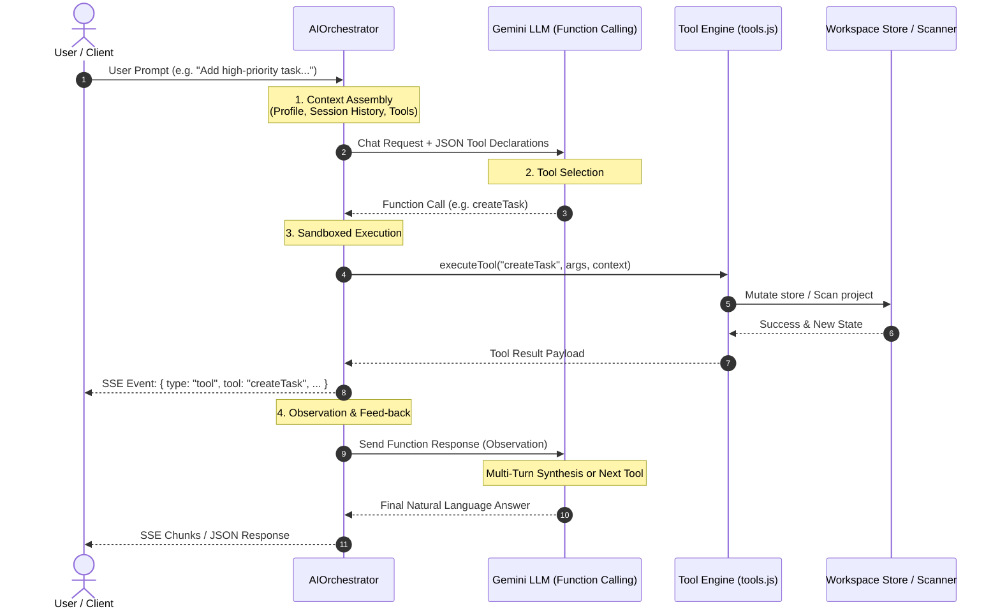
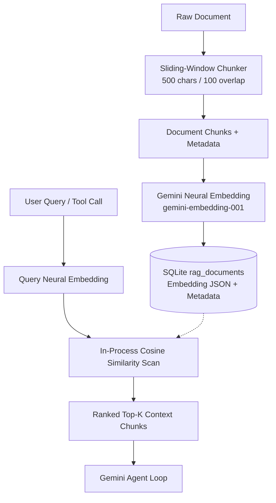

# Lavoro System Architecture

## Overview
Lavoro is an autonomous AI Productivity Agent designed to manage tasks, schedule reminders, organize daily plans, and search local codebases and knowledge documents.

Rather than relying on single-shot completions or fragile regex matching, Lavoro implements an iterative **Plan → Act → Observe → Repeat** agent loop powered by Gemini's native function-calling API, with an offline deterministic fallback.

---

## 1. The Autonomous Agent Loop

The core interaction follows a 4-stage lifecycle:



### Stage 1: Context Assembly
When a request arrives at `/api/ai/chat` or `/api/ai/stream`:
- The user's active session state, preferences, and workspace status are retrieved from `store.js`.
- The conversation history is assembled along with system instructions defined in `ai/prompts.js`.
- Available tool schemas from `ai/tools.js` are packaged into the request payload.

### Stage 2: Tool Selection
- The request is sent to Gemini with native function declarations (`TOOL_DECLARATIONS`).
- Gemini's reasoning engine analyzes the intent and determines whether a tool should be invoked or if a direct conversational response is appropriate.
- When an action is required, Gemini returns one or more structured `functionCall` objects containing validated arguments.

### Stage 3: Sandboxed Execution
- The `AIOrchestrator` receives the function call and dispatches execution to `executeTool(name, args, context)` in `backend/src/ai/tools.js`.
- Tools run within controlled boundaries:
  - `createTask`: Adds tasks to the workspace with priority, category, and due date validation.
  - `addReminder`: Registers scheduled alerts into the user's reminder list.
  - `createDailyPlan`: Compiles a time-blocked schedule of focus blocks, tasks, and breaks.
  - `searchProject`: Searches the project workspace for matching files and text snippets.
  - `queryDocuments`: Performs retrieval over indexed knowledge documents.
  - `getWorkspaceSummary`: Provides an up-to-date summary of active tasks and reminders.
- Tool events are emitted to the client via Server-Sent Events (`SSE`) so the user sees live execution feedback in the UI.

### Stage 4: Observation & Synthesis
- The output of the executed tool (status, error messages, or created entities) is packaged as a `functionResponse` and sent back into the Gemini chat session.
- Gemini observes the result and can either:
  1. Call another tool if multi-step reasoning is required (up to `maxIterations = 4`).
  2. Synthesize a comprehensive natural-language response explaining what action was taken and offering relevant next steps.

---

## 2. Tool Declarations Schema

All tools are declared with strict JSON Schema definitions accepted by `@google/generative-ai`:

| Tool Name | Parameters | Description |
|:---|:---|:---|
| `createTask` | `title` (req), `priority`, `dueDate`, `category` | Create a new task in the productivity workspace. |
| `addReminder` | `text` (req), `time` | Schedule a reminder with a specific time or description. |
| `createDailyPlan` | `focusBlocks`, `tasks`, `breaks` | Generate or structure a daily time-blocked plan. |
| `searchProject` | `query` (req), `maxResults` | Search codebase files for matching text, functions, or filenames. |
| `queryDocuments` | `query` (req), `limit` | Search the knowledge base for relevant documents. |
| `getWorkspaceSummary` | *none* | Retrieve current pending tasks, reminders, and profile state. |

---

## 3. Resilient Fallback Architecture

To ensure 100% offline usability, testability, and CI reliability without requiring a live `GEMINI_API_KEY`:

```
               Incoming Request
                      │
           ┌──────────┴──────────┐
           ▼                     ▼
   [GEMINI_API_KEY Set]   [No Key / Offline]
           │                     │
           ▼                     ▼
     GeminiProvider        DemoProvider
     (Native SDK)       (Deterministic Rules)
           │                     │
           └──────────┬──────────┘
                      ▼
             backend/src/ai/tools.js
                 (executeTool)
                      │
                      ▼
               Workspace Store
```

- **`GeminiProvider`**: Uses the official Google Generative AI SDK (`@google/generative-ai`) to execute live function-calling and multi-turn loops.
- **`DemoProvider`**: Uses deterministic intent detection to parse user commands into tool invocations, executes the exact same `executeTool()` engine, and crafts contextual answers.
- Both providers conform to identical interfaces (`runAgentLoop`, `streamAgentLoop`), allowing tests and benchmarks to run cleanly with zero external network dependencies.

---

## 4. Evaluation & Quality Assurance

Lavoro includes a deterministic evaluation benchmark suite in `scripts/eval-agent.js`:
- Evaluates 18 realistic user prompts across 6 distinct categories (Task Management, Reminders, Day Planning, Codebase Search, Knowledge Retrieval, and Conversational / No-Tool).
- Asserts tool selection accuracy, parameter handling, and false-positive avoidance.
- Produces a timestamped, checked-in evaluation report in `EVALS.md`.
- Can be run at any time via:
  ```bash
  npm run eval
  ```

---

## 5. Persistence Layer & Migrations

To support live production demos without requiring external database servers or complex cloud infrastructure, Lavoro implements an embedded SQLite persistence layer via `better-sqlite3`:

```
                           DATABASE_URL
                                │
                 ┌──────────────┴──────────────┐
                 ▼                             ▼
        [DATABASE_URL Set]           [DATABASE_URL Unset]
                 │                             │
                 ▼                             ▼
       SQLite (better-sqlite3)         Ephemeral In-Memory
         - WAL journal mode            - Explicit warning logged
         - Foreign keys enabled        - Volatile Maps & Arrays
         - Auto-applied migrations     - Fast isolated dev
```

### Database Schema & Migrations
Database tables are provisioned via sequential, versioned SQL migrations in `backend/src/db/migrations/`:
1. `001_create_users_and_auth.sql`: `users` (bcrypt-hashed credentials) and `refresh_tokens` (with atomic rotation and revocation).
2. `002_create_sessions_tasks_reminders.sql`: `sessions`, `tasks`, `reminders`, `plans`, `messages` (chat history), and `memories`.
3. `003_create_rag_documents.sql`: `rag_documents` (content, metadata, and 8-dimensional vector embeddings).
4. `004_create_jobs.sql`: `jobs` (asynchronous background queue states and worker output payloads).

Migrations are tracked in the `_migrations` table and run automatically upon database connection or via the standalone CLI command:
```bash
npm run migrate
```

### Restart Survival & Honesty Principle
- When `DATABASE_URL` is provided (e.g. `sqlite://./data/lavoro.db`), all user entities, workspace tasks, reminders, daily plans, chat history, and background jobs persist across server reboots.
- If `DATABASE_URL` is omitted, Lavoro transparently falls back to in-memory mode and explicitly logs:
  `⚠️  DATABASE_URL is not set — falling back to ephemeral in-memory storage (data will vanish on restart). Set DATABASE_URL to enable real persistence (e.g., sqlite://./data/lavoro.db).`

---

## 6. Retrieval-Augmented Generation (RAG) Pipeline

Lavoro implements an embedded, production-grade RAG pipeline designed for grounded assistant responses without third-party vector database dependencies:



### Key Components

1. **Neural Embeddings (`gemini-embedding-001`)**:
   - Generates 3072-dimensional dense semantic vectors using Google Generative AI's neural embedding model.
   - Provides an offline, deterministic fallback generator for CI test runners where `GEMINI_API_KEY` is not present.

2. **Recursive Natural Boundary Chunking**:
   - Documents longer than 500 characters are partitioned into overlapping windows (100-character overlap) along paragraph (`\n\n`), sentence (`. `), and word boundaries.
   - Chunks inherit parent metadata alongside `parentDocId`, `chunkIndex`, and `totalChunks` tracking.

3. **In-Process Cosine Similarity Scan**:
   - Embeddings are stored as JSON arrays directly in the `rag_documents` table in SQLite.
   - At query time, the system computes cosine similarity between the query vector and candidate chunk vectors in-process:
     $$\text{sim}(\vec{u}, \vec{v}) = \frac{\vec{u} \cdot \vec{v}}{\|\vec{u}\| \|\vec{v}\|}$$
   - **Explainable Architectural Choice**: At personal and executive team scale (<50,000 chunks), in-memory/in-process vector comparison takes <5ms. Operating an external dedicated vector database (such as Pinecone, Qdrant, or Milvus) introduces operational maintenance, network round trips, and failure modes that are unnecessary at this data scale.


