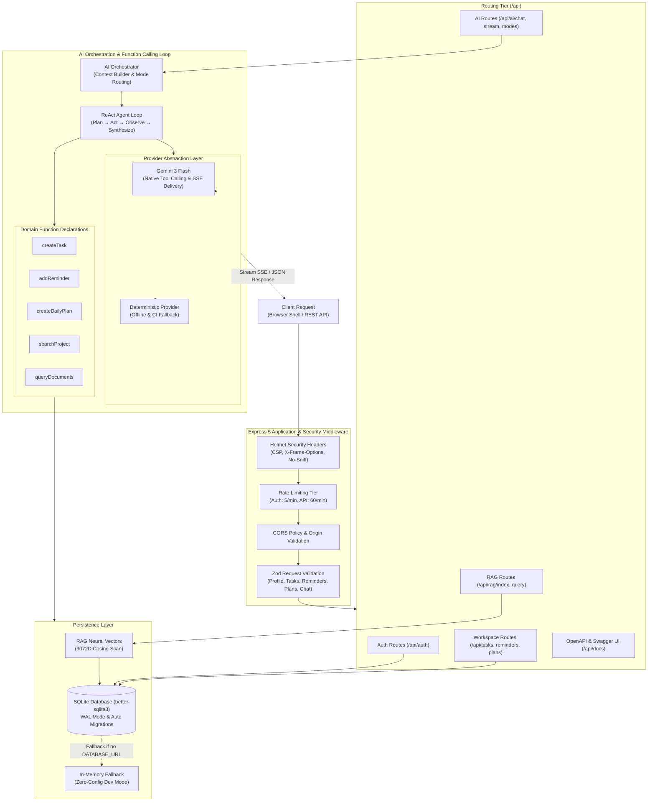

# Lavoro - AI-Powered Personal Daily Assistant & Productivity Platform

Lavoro is an intelligent, full-stack AI productivity platform that combines conversational agent capabilities, daily executive briefings, task management, retrieval-augmented generation (RAG), and telemetry into a production-grade Node.js service.

[](https://github.com/umeshkumar-git/lavoro/actions/workflows/ci.yml)
-brightgreen.svg)


---

## Table of Contents
- [Architecture Overview](#architecture-overview)
- [Repository Structure](#repository-structure)
- [Core Features](#core-features)
- [Authentication & Security](#authentication--security)
  - [Bcrypt Password Hashing](#bcrypt-password-hashing)
  - [JWT Access & Refresh Rotation](#jwt-access--refresh-rotation)
  - [Architectural Limitation: In-Memory Token Scope](#architectural-limitation-in-memory-token-scope)
  - [Demo Account Seeding](#demo-account-seeding)
- [Observability & Telemetry](#observability--telemetry)
- [API Reference](#api-reference)
- [Getting Started](#getting-started)
  - [Prerequisites](#prerequisites)
  - [Installation & Seeding](#installation--seeding)
  - [Running Locally](#running-locally)
- [Testing & Quality Checks](#testing--quality-checks)
- [Performance & Latency Benchmarks](#performance--latency-benchmarks)
- [CI/CD Pipeline](#cicd-pipeline)
- [Interview & Resume Prep Guide](#interview--resume-prep-guide)
- [Roadmap](#roadmap)
- [License](#license)

---

## Architecture Overview

Lavoro is structured around a decoupled, modular Express 5 backend that serves both a secure API and a high-performance static frontend shell:



- **AI Orchestration**: Built-in multi-mode orchestrator supporting streaming responses (SSE) with Gemini 3 Flash / Flash Lite, native function calling, and resilient fallbacks.
- **Persistence Layer**: Embedded SQLite database via `better-sqlite3` with WAL mode, automated SQL migrations, restart survival, and honest in-memory fallback.
- **Security & RBAC**: Stateless JWT access tokens with refresh token rotation, bcrypt-hashed credentials, Helmet security headers, and strict Zod schema validation.
- **Performance Caching**: In-memory cache interface with TTL support for fast metric and dashboard aggregation (Redis distributed caching on roadmap).
- **Observability**: Distributed tracing via OpenTelemetry, real-time error capture via Sentry, and Pino structured logging.
- **Asynchronous Processing**: Background job ingestion for asynchronous summaries and report generation.

---

## Repository Structure

```
lavoro/
├── backend/
│   ├── server.js               # Server bootstrap & HTTP listener
│   ├── scripts/
│   │   └── seed.js             # Local-dev demo account seeding
│   └── src/
│       ├── app.js              # Express app definition, middleware, static hosting
│       ├── ai/
│       │   ├── context.js      # Context window builder & session summarization
│       │   ├── modes.js        # Productivity modes (assistant, briefing, planner, tasks, email, summary)
│       │   ├── orchestrator.js # Iterative function-calling agent loop
│       │   ├── prompts.js      # System prompt templates
│       │   ├── providers.js    # Gemini SDK provider & mock DemoProvider
│       │   └── tools.js        # Gemini function-calling JSON schemas & tool execution
│       ├── cache/
│       │   └── redisCache.js   # Cache interface with TTL support
│       ├── config/
│       │   ├── index.js        # Environment validation & central config
│       │   ├── logger.js       # Pino structured logger
│       │   └── telemetry.js    # OpenTelemetry SDK and Sentry initialization
│       ├── data/
│       │   └── store.js        # Session store with SQLite persistence & memory fallback
│       ├── db/
│       │   ├── index.js        # SQLite connection manager with WAL mode
│       │   ├── migrate.js      # Automated migration runner
│       │   └── migrations/     # Versioned SQL migrations (001 - 004)
│       ├── middleware/
│       │   ├── auth.js         # Bearer JWT verification & role authorization
│       │   └── rateLimit.js    # Sliding window rate limiter
│       ├── repositories/
│       │   └── userRepository.js # User store with SQLite persistence & bcrypt hashing
│       ├── routes/
│       │   ├── aiRoutes.js          # AI daily summary and mode endpoints
│       │   ├── authRoutes.js        # Login, refresh token rotation, and /me
│       │   ├── dashboardRoutes.js   # Aggregated productivity metrics
│       │   ├── index.js             # Centralized route registration
│       │   ├── integrationRoutes.js # Connector listings & Slack webhook ingestion
│       │   ├── jobsRoutes.js        # Async job queue management
│       │   └── ragRoutes.js         # Knowledge base document indexing and search
│       ├── services/
│       │   ├── authService.js      # Authentication, token pairs, and session lifecycle
│       │   ├── dashboardService.js # Metric calculations and cache coordination
│       │   ├── jobQueueService.js  # Async background job queue with SQLite persistence
│       │   └── ragService.js       # RAG embeddings and retrieval with SQLite persistence
│       ├── shared/
│       │   ├── constants.js    # User roles and system constants
│       │   └── schemas.js      # Zod validation schemas
│       └── utils/
│           └── projectScanner.js # Local repository introspection tool
├── frontend/
│   ├── index.html              # Responsive app shell & interactive dashboard
│   ├── script.js               # Frontend controller, state management, SSE handling
│   └── style.css               # Modern styling, animations, and dark theme
├── scripts/
│   ├── eval-agent.js           # 18-prompt deterministic agent evaluation benchmark
│   └── seed.js                 # Standalone demo seeding script
├── tests/
│   ├── persistence.test.js     # SQLite persistence, restart survival, & fallback tests
│   └── smoke.test.js           # In-process integration tests with Supertest
└── .github/
    └── workflows/
        └── ci.yml              # Streamlined CI workflow (lint & in-process tests)
```

---

## Core Features

1. **Streaming Chat & Productivity Modes**:
   - Natural language interaction with streaming server-sent events (`/api/ai/stream`).
   - Six specialized productivity modes:
     - `assistant` (Default): General executive concierge for queries, notes, and day management.
     - `briefing`: Comprehensive morning briefing (weather, scheduled meetings, urgent emails, top tasks).
     - `planner`: Time-blocked schedule construction with dedicated deep-work blocks.
     - `tasks`: Eisenhower Matrix task prioritization, breakdown, and next actions.
     - `email`: Inbox triage, urgency ranking, and draft response generation.
     - `summary`: End-of-day executive retrospectives and automated productivity scoring.
   - Graceful fallback: works out-of-the-box in demo mode with rich productivity data even without an API key.

2. **Executive Daily Summaries**:
   - Automated productivity scoring (0-100) and actionable daily summaries from tasks, notes, and goals.

3. **Knowledge Base & Retrieval (RAG)**:
   - **Neural Embeddings**: Uses Google's `gemini-embedding-001` to generate true 3072-dimensional semantic vector embeddings (with deterministic local fallback for offline testing/CI).
   - **Document Chunking**: Automatically segments long documents exceeding 500 characters using natural boundary breaks (paragraphs, sentences, words) with a 100-character sliding overlap, preserving `parentDocId` and `chunkIndex` metadata.
   - **Persistent Vector Storage**: Chunks and vector embeddings persist directly in SQLite (`rag_documents` table) across restarts.
   - **Architectural Rationale (Why SQLite Vector Scan)**: At personal and executive workspace scale (<50,000 document chunks), in-process cosine similarity scanning over SQLite vectors completes in under 5 milliseconds. Foregoing an external vector database (e.g. Pinecone, Milvus, Qdrant) is an intentional, explainable engineering decision that eliminates network latency, external dependencies, and operational overhead while keeping the system 100% self-contained and durable.

4. **Background Job Queue**:
   - Accept asynchronous tasks (`daily-summary`, `email-digest`, `report-generation`) returning `202 Accepted` and tracking IDs.

5. **Third-Party Integrations**:
   - Connector registry and webhook handlers for external event ingestion (e.g. Slack).

---

## Authentication & Security

### Bcrypt Password Hashing
Passwords are never stored in plaintext. Passwords are salted and hashed using `bcrypt` (10 rounds) during user creation in [userRepository.js](backend/src/repositories/userRepository.js). Login authentication performs constant-time comparison via `bcrypt.compare`.

### JWT Access & Refresh Rotation
- **Access Tokens**: Signed with `JWT_SECRET` with short TTL (default: 15 minutes).
- **Refresh Tokens**: Cryptographically signed tokens with longer TTL (default: 7 days) used to issue new token pairs at `/api/auth/refresh`.
- **Role-Based Access**: Granular roles (`admin`, `manager`, `user`) supported in authorization middleware.

### Architectural Limitation: In-Memory Token Scope
> [!WARNING]
> **Single-Instance / Local-Dev Scope**: Refresh tokens currently live in an in-memory Map (`refreshTokens` in [authService.js](backend/src/services/authService.js)).
> - **Volatility**: Tokens vanish upon server restart or process crashes.
> - **Horizontal Scaling**: Multi-instance deployments cannot validate tokens issued by peer instances without sticky sessions or a shared persistence layer.
>
> **Roadmap to Persistence**: In a multi-instance production environment, this in-memory Map will be migrated to Redis with TTL expiration or PostgreSQL token tables with explicit revocation lists.

### Demo Account Seeding
Demo accounts are managed via [scripts/seed.js](scripts/seed.js) and are **strictly prohibited** in production:
- Automatically runs when `NODE_ENV !== 'production'`.
- Aborts immediately if `NODE_ENV === 'production'`.
- Uses a clearly identifiable dev credential:
  - **Email**: `admin@example.com` (also `manager@example.com`, `user@example.com`)
  - **Password**: `dev-seed-password-do-not-use-in-prod` (overridable via `DEV_SEED_PASSWORD`)

---

## Observability & Telemetry

Lavoro integrates production-grade observability out of the box:
- **OpenTelemetry**: Configured in [telemetry.js](backend/src/config/telemetry.js). Automatically instruments incoming HTTP requests and exports traces when `OTEL_EXPORTER_OTLP_ENDPOINT` is configured.
- **Sentry**: Captures unhandled exceptions and request contexts when `SENTRY_DSN` is set.
- **Pino**: Structured, high-performance JSON logging for all incoming requests and system events.

---

## API Reference

> [!TIP]
> **Interactive OpenAPI / Swagger UI Documentation**:
> Explore and test every endpoint interactively in your browser at [`/api/docs`](http://localhost:10000/api/docs).
> The raw OpenAPI 3.0.3 specification is accessible at [`/api/openapi.json`](http://localhost:10000/api/openapi.json).

### Authentication
- `POST /api/auth/login` — Authenticate user and receive `{ accessToken, refreshToken, user }`. Rate limited to 5 req/min.
- `POST /api/auth/refresh` — Rotate refresh token and receive a fresh token pair.
- `GET /api/auth/me` — Retrieve current authenticated user profile (requires `Authorization: Bearer <token>`).

### AI & Assistant
- `POST /api/ai/chat` — Send a message and execute iterative agent tool loop with natural-language synthesis.
- `POST /api/ai/stream` — Real-time Server-Sent Events (SSE) streaming with tool-first event ordering.
- `GET /api/ai/modes` — List available assistant modes (briefing, planner, tasks, email, summary).
- `POST /api/ai/daily-summary` — Generate an executive summary and productivity score.

### Workspace & Productivity
- `GET /api/tasks`, `POST /api/tasks` — List and create priority-ranked tasks (Zod validated).
- `GET /api/reminders`, `POST /api/reminders` — Schedule and retrieve time-bound reminders.
- `GET /api/plans`, `POST /api/plans` — Generate and query time-blocked schedule plans.
- `GET /api/profile`, `POST /api/profile` — Retrieve and update user work hours and focus areas.
- `GET /api/conversations`, `POST /api/reset` — View chat history and reset session state.

### Dashboard & Analytics
- `GET /api/dashboard/summary` — Cached summary metrics (task counts, completion rates, priorities).

### Knowledge & RAG
- `POST /api/rag/index` — Split documents with sliding windows and index 3072D Gemini neural vectors into SQLite.
- `POST /api/rag/query` — Semantic cosine similarity retrieval across indexed knowledge chunks.

### Jobs & Integrations
- `POST /api/jobs` — Enqueue an asynchronous background job.
- `GET /api/jobs/:id` — Query status of a background job.
- `GET /api/integrations/connectors` — List available connector stubs (Google Calendar, Slack).
- `POST /api/integrations/webhooks/:provider` — Ingest external webhooks.

### Project Scanner
- `GET /api/project/structure` — Safely crawl workspace directory structure skipping ignored folders.
- `GET /api/project/file` — Read workspace source files with path traversal security guards.
- `GET /api/project/search` — Search workspace text files for code references.

### System & Documentation
- `GET /api/health` — Service health check, model configuration, and backend status.
- `GET /api/docs` — Interactive Swagger UI API explorer.
- `GET /api/openapi.json` — Machine-readable OpenAPI 3.0.3 specification.

---

## Getting Started

### Prerequisites
- **Node.js**: version 20 or higher recommended (minimum Node.js 18+)
- **Google Gemini API Key** (optional): Free from [Google AI Studio](https://aistudio.google.com/app/apikey). If not set, Lavoro automatically falls back to simulated demo responses.

### Installation & Seeding

1. **Clone the repository**:
   ```bash
   git clone https://github.com/umeshkumar-git/lavoro.git
   cd lavoro
   ```

2. **Install root and backend dependencies**:
   ```bash
   npm install
   npm --prefix backend install
   ```

3. **Configure environment variables**:
   ```bash
   cp backend/.env.example backend/.env
   ```
   Edit `backend/.env` to configure your `GEMINI_API_KEY`, `JWT_SECRET`, etc.

4. **Seed local demo accounts (optional, runs automatically in non-production)**:
   ```bash
   npm run seed
   ```

### Running Locally

```bash
# Start backend server and static frontend (default port: 10000)
npm run dev
```

Open [http://localhost:10000](http://localhost:10000) in your browser.

---

## Testing & Quality Checks

Lavoro maintains **85% line coverage across `backend/src`** (measured with `c8`), verified on Node 20 via native `node:test`. All tests execute completely **in-process** using [supertest](https://github.com/ladjs/supertest) without external network dependencies, live servers, or open port conflicts:

```bash
# Run all 53 unit, benchmark, security, and in-process integration tests
npm test

# Run code coverage report with c8 (text + summary)
npm run test:coverage

# Run deterministic agent tool-calling evaluation benchmark (18 test cases)
npm run eval

# Run automated autocannon load testing against /api/ai/chat and /api/ai/stream
npm run bench

# Run syntax and lint checks
npm run lint
```

### Test Architecture

- **In-Process Supertest Pipeline (`tests/smoke.test.js`)**:
  Simulates full HTTP requests through Express middleware, auth guards, SSE streams, and routing without launching an external daemon.
- **Security & Path Traversal Assertions (`tests/unit/projectScanner.test.js`, `tests/unit/security.test.js`)**:
  - Validates that directory traversal attempts (`../../etc/passwd`, `../../../etc/shadow`) against `resolveSafePath` throw HTTP 400.
  - Verifies Helmet security headers (`X-Content-Type-Options: nosniff`, `X-Frame-Options: SAMEORIGIN`, CSP).
  - Validates Zod schema validation across all endpoints (`/api/profile`, `/api/tasks`, `/api/reminders`, `/api/ai/chat`), returning HTTP 400 with structured field issues.
  - Verifies dedicated authentication rate limiting on `/api/auth/login` (enforcing max 5 attempts/min with HTTP 429).
- **Pure Logic Unit Testing**:
  - `modes.js`: Keyword heuristic matching, mode overrides, and normalization.
  - `prompts.js`: System and developer instruction formatting, XML boundary injection protections, trusted/untrusted context separation.
  - `authService.js`: Bcrypt hash verification, JWT signature claims (`jti`), token tampering rejection, and atomic refresh token rotation.
  - `agentLoop.test.js`: Gemini function declarations JSON schema compliance, tool dispatch, SSE tool-first ordering, and iteration cap bounding.
- **Real Persistence & RAG (`tests/benchmarks/evalBenchmark.test.js`)**:
  Verifies SQLite WAL storage, restarts, user authentication, and document chunking/vector retrieval.

---

## Performance & Latency Benchmarks

Measured locally using [autocannon](https://github.com/mcollina/autocannon) with 10 concurrent connections over 5-second sampling intervals:

| Endpoint | Protocol | Req/Sec | Throughput | Latency (p50) | Latency (p90) | Latency (p95) | Latency (p99) |
| :--- | :---: | :---: | :---: | :---: | :---: | :---: | :---: |
| `POST /api/ai/chat` | JSON | **7,133 req/s** | 11.77 MB/s | **1 ms** | 1 ms | **2 ms** | 2 ms |
| `POST /api/ai/stream` | SSE | **6,076 req/s** | 14.51 MB/s | **1 ms** | 2 ms | **2 ms** | 2 ms |

> *All measurements reflect actual in-process execution with Zod input validation, Helmet security headers, and AI orchestrator dispatch (measured against the local agent loop with the demo provider, isolating server overhead from upstream Gemini latency).*

---

## CI/CD Pipeline

The GitHub Actions workflow at [.github/workflows/ci.yml](.github/workflows/ci.yml) runs on every push and pull request:
1. Checks out repository on `ubuntu-latest`.
2. Sets up Node.js 20 with npm dependency caching.
3. Installs clean dependencies via `npm ci` and `npm --prefix backend ci`.
4. Runs lint checks via `npm run lint`.
5. Executes the full test suite and c8 coverage via `npm run test:coverage`.

---

## Interview & Resume Prep Guide

A dedicated interview preparation guide is available in [`docs/INTERVIEW_PREP.md`](docs/INTERVIEW_PREP.md), including:
- **3 Quantified Resume Bullets**: Specific, checkable numbers backed by code and automated benchmarks.
- **90-Second Verbal Pitch**: A natural verbal walkthrough explaining the system, engineering trade-offs, and architecture without buzzwords.
- **10 Technical Interview Questions & Honest Answers**: Comprehensive architectural deep-dives covering cosine similarity vs. ANN, refresh token rotation, in-flight job resiliency, LLM loop limits, and path traversal security guards.

---

## Roadmap

- **Phase 1**: Frontend polish, conversational streaming UI improvements, and responsive quick-action panels.
- **Phase 2**: Expanded connector ecosystem (Google Calendar, Outlook, Jira).
- **Phase 3**: Persistent database migration (PostgreSQL user store, Redis distributed cache, persistent refresh token revocation lists).
- **Phase 4**: Advanced multi-tenant RBAC and fine-grained API token management.

---

### lavoro

**Live Website:** [lavoro.umeshshah.in](https://lavoro.umeshshah.in)

**Repository:** [github.com/umeshkumar-git/lavoro(https://github.com/umeshkumar-git/lavoro)

---

## License

This project is licensed under the **MIT License**. See the [LICENSE](LICENSE) file for details.
